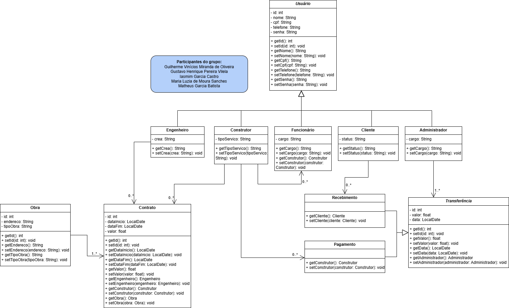

# Projeto final de POO: Construtora

O código neste repositório refere-se ao trabalho final da disciplina de *Programação Orientada a Objetos*, ministrada pela professora *Patrícia Aparecida Proença Ávila*.

## Diagrama de classes

Até o dia 11/12/2024, o diagrama de classes deste projeto é o que está a seguir. Uma vez que esse código passará por posteriores modificações até sua versão finalizada, o diagrama de classes também mudará.

## Em construção...

Posteriores descrições serão adicionadas de acordo com o andamento do projeto.